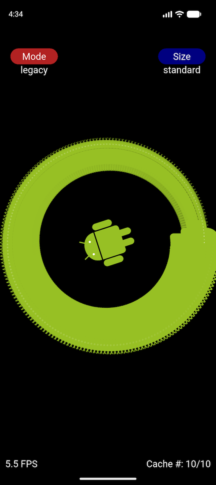
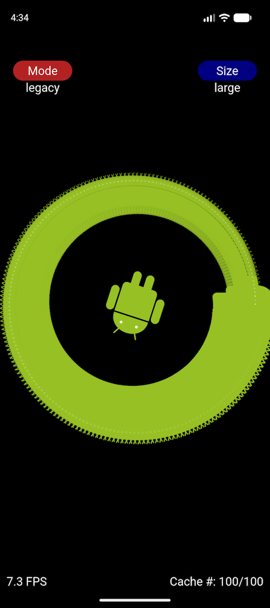
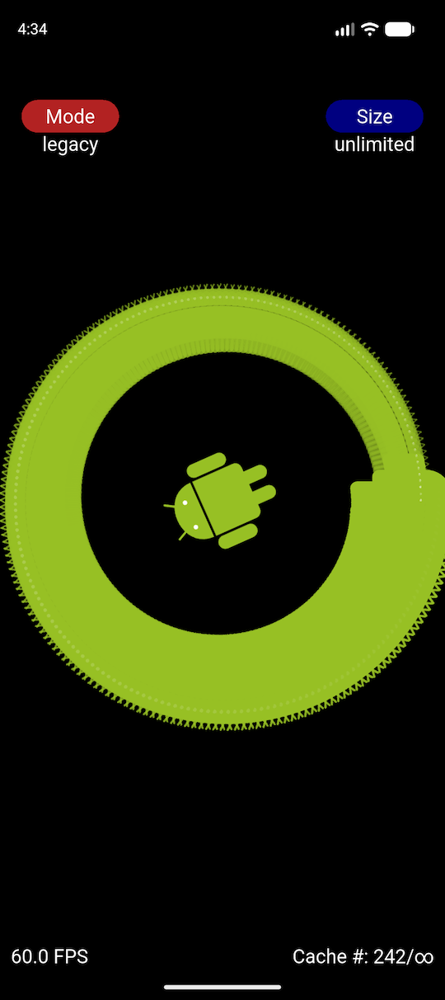

# Testbed for the proposed changes to class Svg

This app shows the proposed changes to class [Svg](https://pub.dev/documentation/flame_svg/latest/svg/Svg-class.html):

* The 'Mode' button changes how the [MemoryCache](https://pub.dev/documentation/flame/latest/cache/MemoryCache-class.html) keys are composed:

	* `legacy`: the current approach, which uses the raw (non-integer) destination dimensions — this results in multiple cache entries being generated for the **same** rendered image dimensions, being subject to floating-point rounding errors
	* `integral`: this uses the integer destination dimensions, which results in cache entries mapping one-to-one with the rendered image dimensions
	* `fixed`: this uses only the integer SVG dimensions, resulting in a **single** cache entry

* The 'Size' button changes the `MemoryCache` size:

	* `standard`: the current default == max `10` entries
	* `medium`: max `50` entries
	* `large`: max `100` entries
	* `huge`: max `250` entries
	* `unlimited`: max entries correspond to the largest representable integer, making the `MemoryCache` property behave like a `Map`.

The `legacy` mode is shown only for performance comparison purposes; it should probably be removed from class `Svg` since:

1. it is subject to floating-point rounding errors, hence re-rendering images that had already been rendered with the same (integer) dimensions, but different cache keys
2. it is not clear when it would be useful to use non-integral cache keys

These are a few results with several 'Mode' and 'Size' combinations:

`legacy/standard`:  

`integral/standard`:  

`legacy/large`:  

`integral/huge`:  

`legacy/unlimited`:  

`fixed/standard`:  

