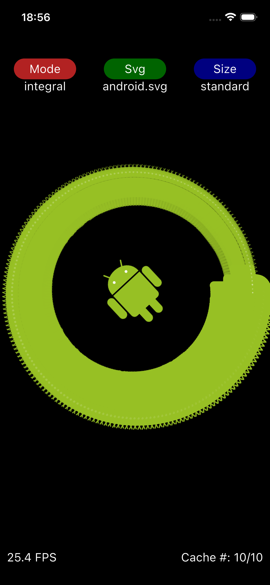
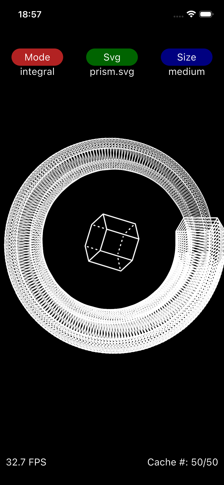
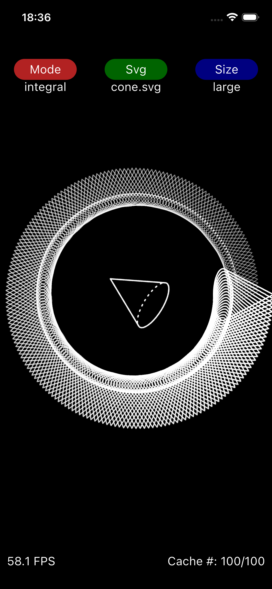
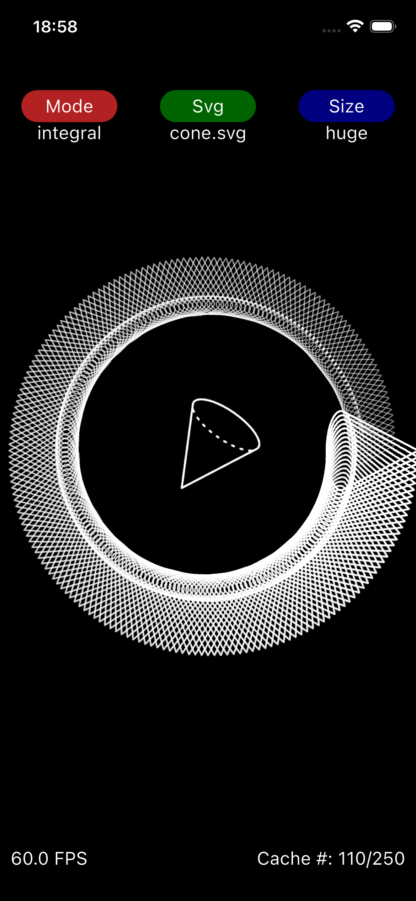
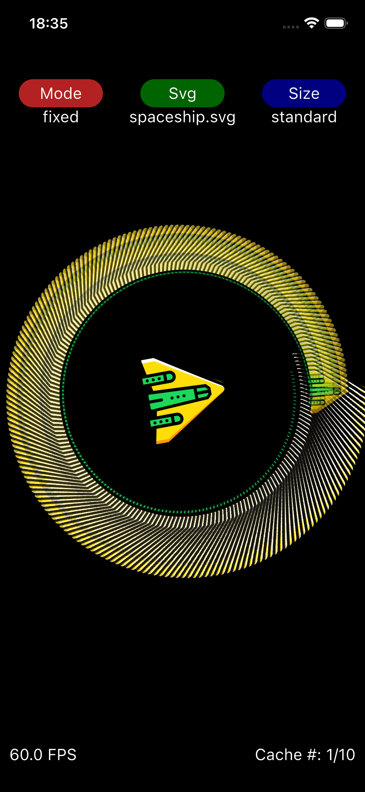

# Testbed for the proposed changes to class Svg

This app shows the proposed changes to class [Svg](https://pub.dev/documentation/flame_svg/latest/svg/Svg-class.html):

* The 'Mode' button changes how the [MemoryCache](https://pub.dev/documentation/flame/latest/cache/MemoryCache-class.html) keys are composed:

	* `integral`: the new default: it uses the integer destination dimensions, which avoids floating-point rounding errors but makes the image cache behave differently from previous versions of class `Svg`; in practice, this should _not_ break existing uses of class `Svg`
	* `fixed`: this uses only the integer SVG dimensions, resulting in a **single** cache entry

* The 'Size' button changes the `MemoryCache` size:

	* `standard`: the current default == max `10` entries
	* `medium`: max `50` entries
	* `large`: max `100` entries
	* `huge`: max `250` entries
	* `unlimited`: max entries correspond to the largest representable integer, making the `MemoryCache` property behave like a `Map`.

These are a few results with several 'Mode' and 'Size' combinations:

`integral/standard`:  

`integral/medium`:  

`integral/large`:  

`integral/huge`:  

`fixed/standard`:  

